# Bienvenido a Ferremás

Este proyecto ha sido creado para la asignatura de Integración de Plataformas del profe Diego.

## Como levantarlo

Abriendo una terminal integrada en el directorio de proyecto:

### `npm start`

Se levanta el aplicativo y se puede visualizar en cualquier navegador de escritorio desde la URL [http://localhost:3000](http://localhost:3000) o en producción [https://ferremas.vercel.app/](https://ferremas.vercel.app/)

## De que se trata el proyecto

El proyecto recrea una app de e-commerce para la ferretería y distribuidora Ferremás.

## Home

Modúlo Home que llama a los componentes Navbar y ProductTable, usandolos para la busqueda de productos en la barra de busqueda o por categoría, a través de la Lambda "consulta-productos" hacia una tabla DynamoDB llamada "ferremas-products" o "manejaStock" para actualizar valores de Stock una vez se realice una compra exitosa.

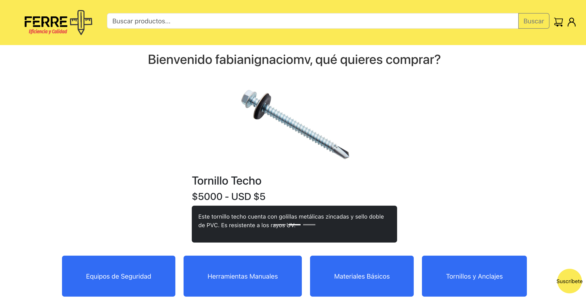

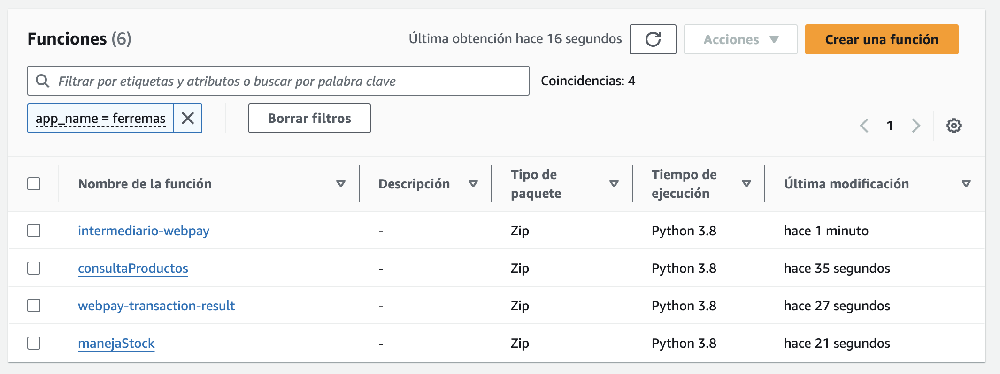

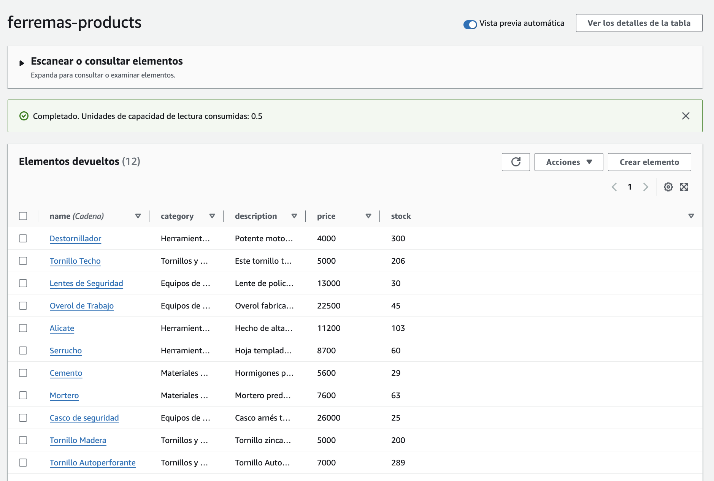

## Newsletter
Para hacer uso del Newsletter se dee hacer click en el botón amarillo de la esquina inferior derecha, ingresar el correo respectivo. Además tendremos ciertos validadores, como que el correo debe llevar una "@" o un ".", o que al suscribirse al newsletter, esto deba realizarse con un correo único.

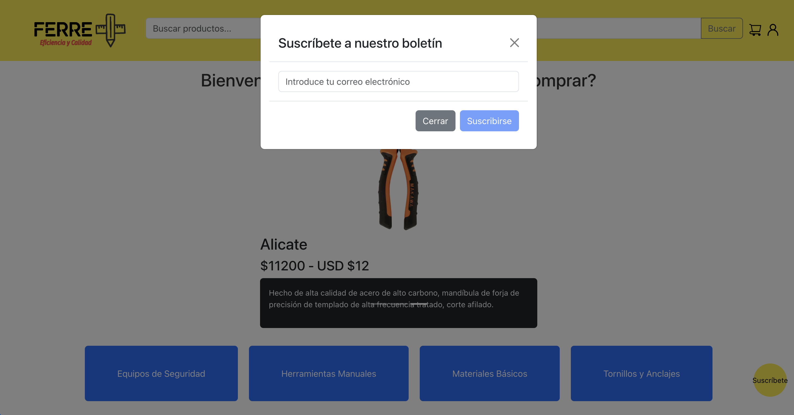

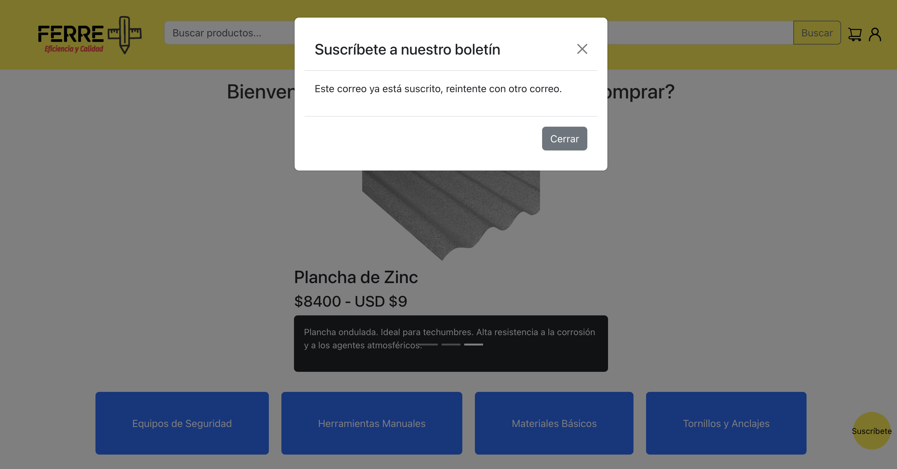

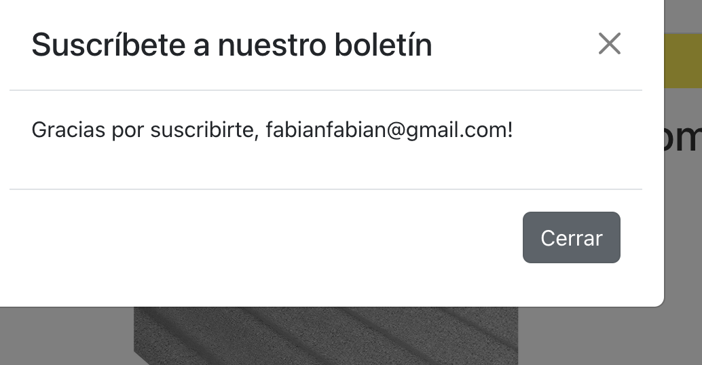

## Pantalla de Checkout

Se definió un dropdown cart para mostrar los productos que iremos agregando, de manea dinámica, además desde el componente Checkout se llama a los componentes Cart, e Inicio de sesión, para obtener un descuento del 20% en el total de la compra.

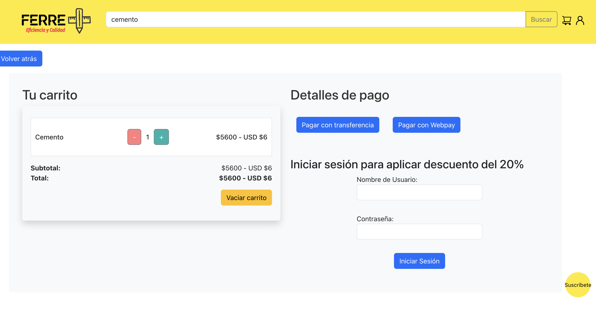

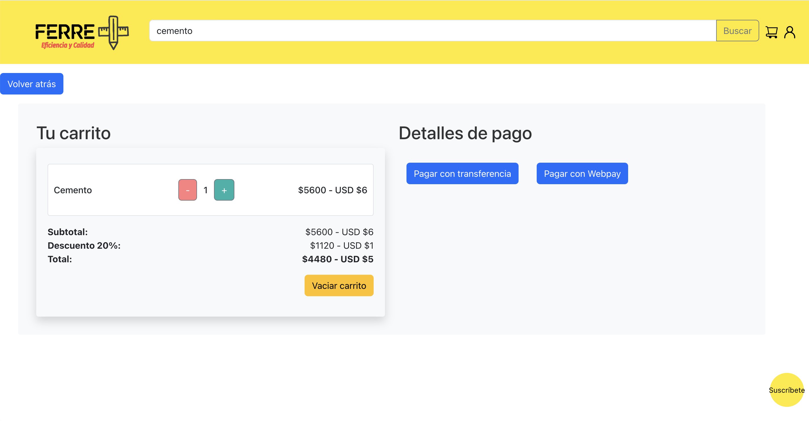

## Pantalla de pago - Conexión con transbank

Tendremos 2 botones en la pantalla de pago: Pago con Transferencia, que al hacerle click nos muestra los datos de transferencia de la empresa, y el botón Pago Webpay, que nos deriva a una pantalla de pago desde la plataforma de Webpay.

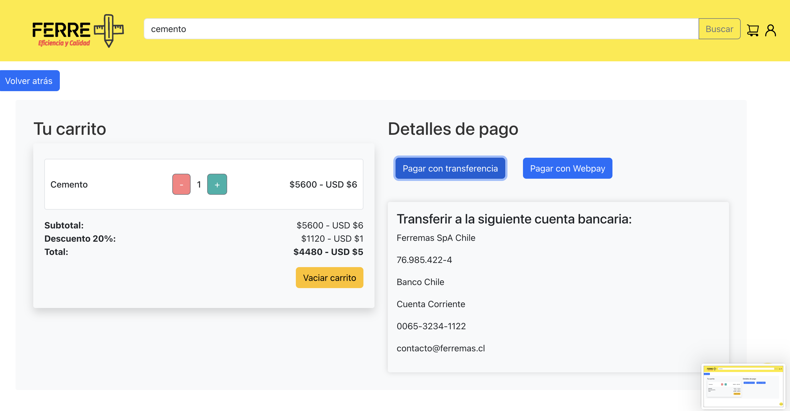

Para hacer la conexión a webpay se definieron 2 lambda: "intermediario-webpay" que se encarga de enviar una petición a la API de Integración de Transbank con datos como el Numero de Orden de Compra, Número de Sesión Inicia, Código de Autenticación, y el Monto de la compra, recibe el token de compra obtenido desde la llamada a la API de crear transacción de Transbank y a través del método POST envía a una pantalla de pago con los datos de la compra previamente realizada.

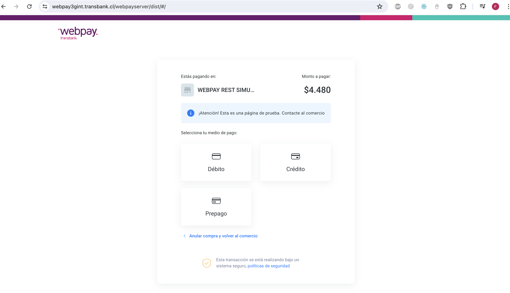

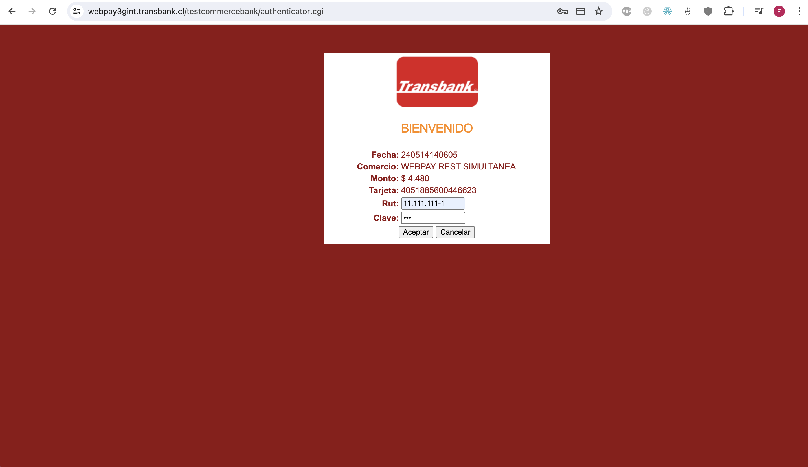

## Pago exitoso

Para validar un pago exitoso enviamos a través de método PUT, hacia API de confirma transacción de Transbank, y recibimos información como el status de la compra, codigo de autorización, entre otros. Una vez que el pago resulta exitoso, la pantalla de pago refleja información cómo el código de autorización o el número de orden de compra, y finaliza el flujo.

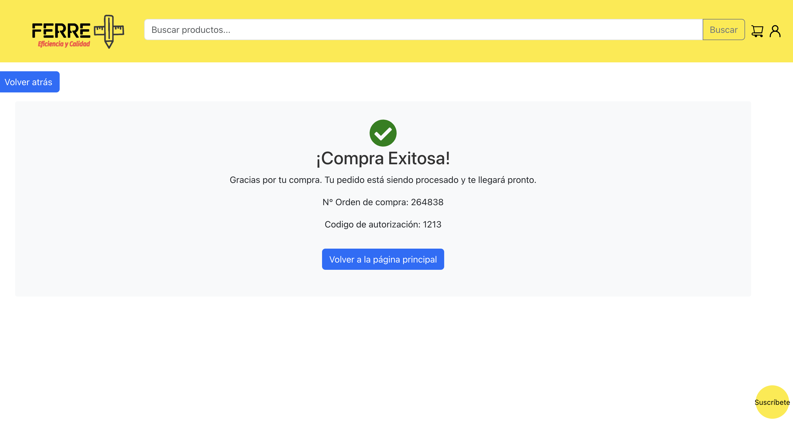