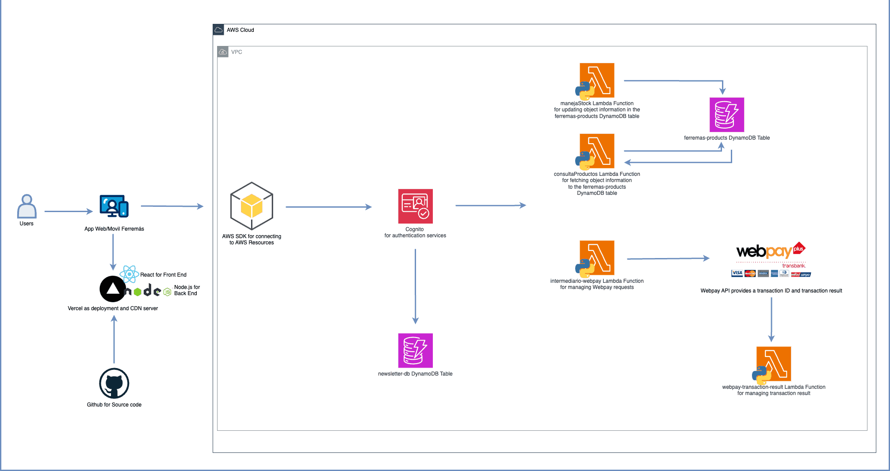
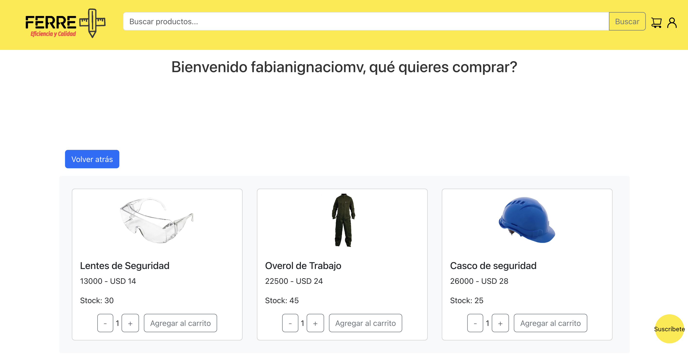
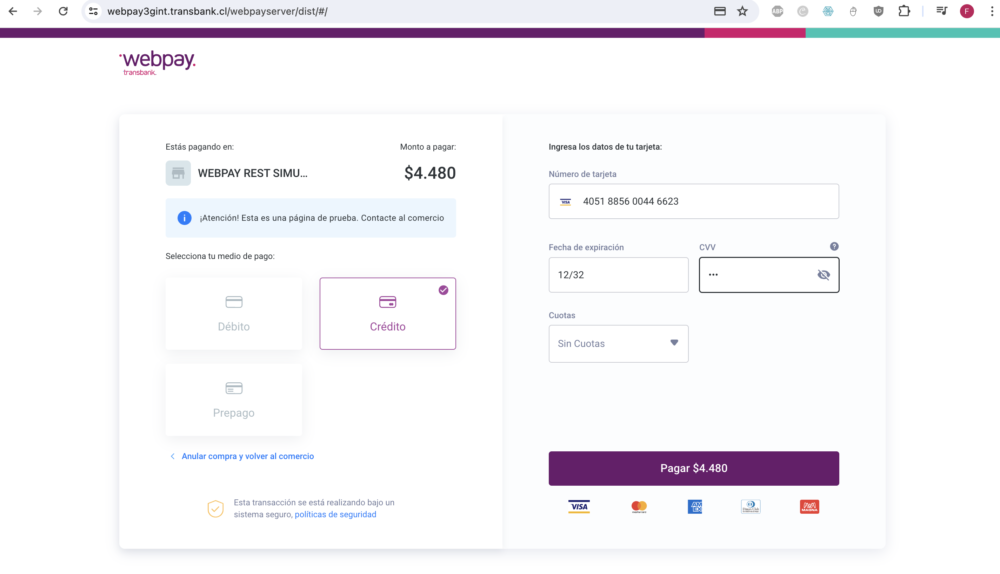

# Bienvenido a Ferremás

Este proyecto fue desarrollado como parte del curso de Integración de Plataformas en Duoc UC, bajo la orientación del profe Diego Cares. Agradecer su apoyo y guía en este proceso.

## Tabla de Contenidos
- [De qué se trata el proyecto](#de-qué-se-trata-el-proyecto)
- [Diagrama de Arquitectura](#diagrama-de-arquitectura)
- [Tecnologías utilizadas](#tecnologías-utilizadas)
- [Descripción de Componentes del Sistema](#descripción-de-componentes-del-sistema)
- [Cómo levantar la aplicación en ambiente local](#cómo-levantar-la-aplicación-en-ambiente-local)
- [Cómo levantar la aplicación en ambiente de producción](#como-levantar-la-aplicación-en-ambiente-de-producción)

---

## De qué se trata el proyecto

El proyecto implementa una app de e-commerce para la ferretería y distribuidora Ferremás.

## Diagrama de Arquitectura

...

---

## Tecnologías utilizadas

Este proyecto se construyó utilizando una variedad de tecnologías líderes en la industria para ofrecer una experiencia de usuario robusta y segura. A continuación, se detalla cada tecnología y su papel dentro del proyecto:

- **React**: Framework de JavaScript utilizado para construir la interfaz de usuario del front-end, proporcionando una experiencia de usuario fluida y reactiva.
- **Node.js**: Entorno de ejecución para JavaScript utilizado en el servidor back-end, permitiendo una construcción eficiente de aplicaciones en red escalables.
- **AWS SDK**: Kit de desarrollo de software que facilita la conexión y el uso de los servicios de Amazon Web Services, permitiendo una integración eficiente y segura con la infraestructura en la nube.
- **AWS Cognito**: Servicio de AWS utilizado para el registro de usuarios y manejo de sesiones, asegurando una gestión de identidades y acceso seguro.
*Para ver imagen del recurso detallado visita [este enlace](./public/cognito.png).*
- **AWS Lambda**: Servicio de computación sin servidor que ejecuta código en respuesta a eventos, utilizado aquí para manejar peticiones back-end, especialmente consultas a DynamoDB.
*Para ver imagen del recurso detallado visita [este enlace](./public/lambdas.png).*
- **DynamoDB**: Base de datos NoSQL ofrecida por AWS, utilizada para almacenar los datos de los productos de la ferretería y la información de contacto de los usuarios suscritos al newsletter.
*Para ver imagen del recurso detallado visita [este enlace](./public/dynamodb.png).*
- **GitHub**: Plataforma de desarrollo colaborativo utilizada para el control de versiones y el almacenamiento del código fuente del proyecto.
- **Vercel**: Plataforma de despliegue y CDN, utilizada para el alojamiento y la entrega rápida de contenido del front-end.
- **Webpay API**: API de pago integrada para procesar transacciones financieras de manera segura dentro de la aplicación.
- **UF API del Banco Central**: API utilizada para la conversión de moneda de pesos chilenos a dólares, facilitando cálculos financieros precisos y actualizados.

Cada tecnología ha sido seleccionada estratégicamente para asegurar que el proyecto sea escalable, seguro y de alto rendimiento.

---

## Descripción de Componentes del Sistema

### Home

Modúlo Home que llama a los componentes Navbar y ProductTable, usandolos para la busqueda de productos en la barra de busqueda o por categoría, a través de la Lambda "consulta-productos" hacia una tabla DynamoDB llamada "ferremas-products" o "manejaStock" para actualizar valores de Stock una vez se realice una compra exitosa.

### Newsletter
Para hacer uso del Newsletter se dee hacer click en el botón amarillo de la esquina inferior derecha, ingresar el correo respectivo. Además tendremos ciertos validadores, como que el correo debe llevar una "@" o un ".", o que al suscribirse al newsletter, esto deba realizarse con un correo único.

### Pantalla de Checkout

Se definió un dropdown cart para mostrar los productos que iremos agregando, de manea dinámica, además desde el componente Checkout se llama a los componentes Cart, e Inicio de sesión, para obtener un descuento del 20% en el total de la compra.

### Pantalla de pago - Conexión con transbank

Tendremos 2 botones en la pantalla de pago: Pago con Transferencia, que al hacerle click nos muestra los datos de transferencia de la empresa, y el botón Pago Webpay, que nos deriva a una pantalla de pago desde la plataforma de Webpay.

Para hacer la conexión a webpay se definieron 2 lambda: "intermediario-webpay" que se encarga de enviar una petición a la API de Integración de Transbank con datos como el Numero de Orden de Compra, Número de Sesión Inicia, Código de Autenticación, y el Monto de la compra, recibe el token de compra obtenido desde la llamada a la API de crear transacción de Transbank y a través del método POST envía a una pantalla de pago con los datos de la compra previamente realizada.

### Pago exitoso

Para validar un pago exitoso enviamos a través de método PUT, hacia API de confirma transacción de Transbank, y recibimos información como el status de la compra, codigo de autorización, entre otros. Una vez que el pago resulta exitoso, la pantalla de pago refleja información cómo el código de autorización o el número de orden de compra, y finaliza el flujo.

---

## Cómo levantar la aplicación en ambiente local

Abriendo una terminal integrada en el directorio de proyecto:

### `npm start`

Se levanta el aplicativo y se puede visualizar en cualquier navegador de escritorio desde la URL [http://localhost:3000](http://localhost:3000) 

---

## Como levantar la aplicación en ambiente de producción

Acceder directamente a la URL de producción [https://ferremas.vercel.app/](https://ferremas.vercel.app/)

---
